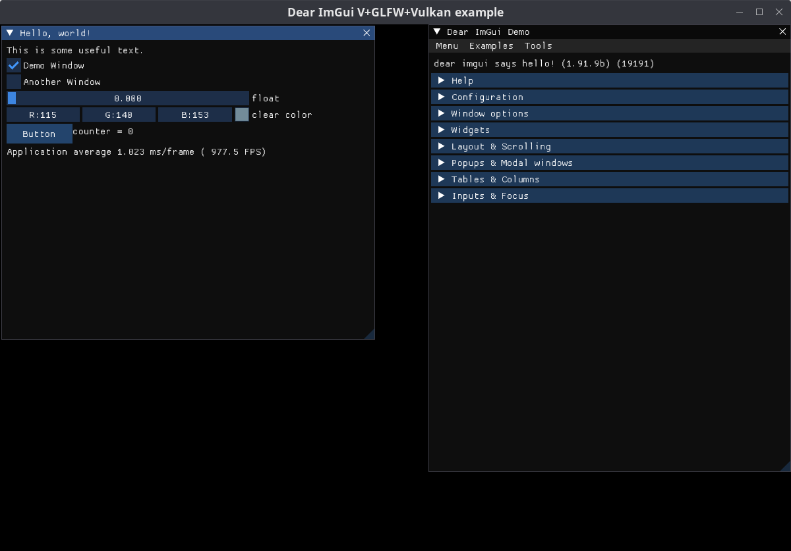

# Shows how to use V Dear ImGui

## Install
```bash
git clone https://github.com/antono2/v_imgui_examples
# Change dir to v_imgui_examples and install dependencies
v install
```
Please make sure to [build VIMGUI library](https://github.com/antono2/imgui#install) and set your `examples/glfw_vulkan/flags.c.v`.


## Run
`v run .`


