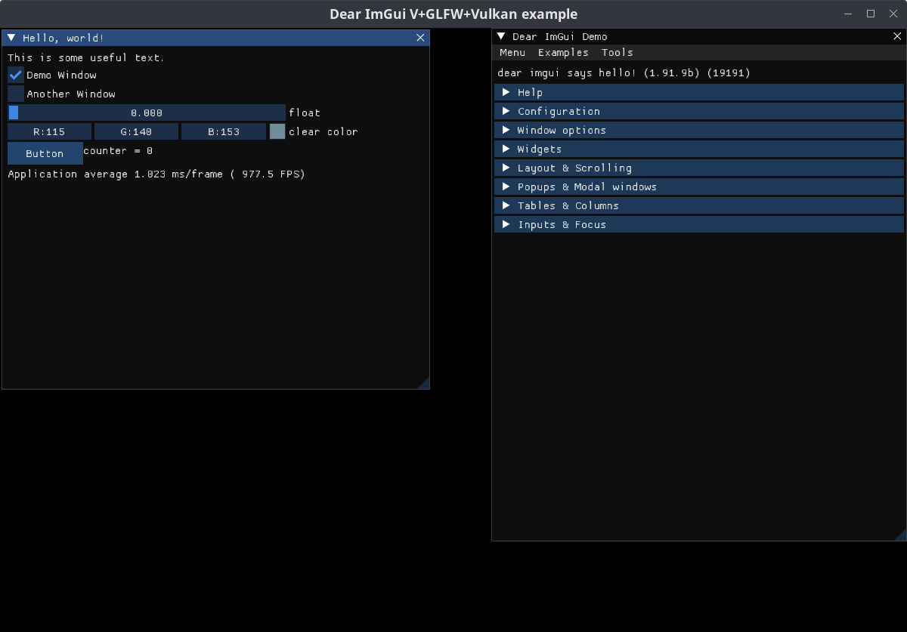

# Shows how to use V Dear ImGui

This repository contains the GLFW/Vulkan example used to validate the
[`antono2/imgui`](https://github.com/antono2/imgui) V bindings.

## Recommended quick start

The ImGui repository owns native-library setup and pins a tested revision of
this example. On Ubuntu or Debian, the shortest supported path is:

```bash
git clone --recursive https://github.com/antono2/imgui
cd imgui
./scripts/setup_linux.sh --install
./scripts/run_demo.sh
```

Use `./scripts/setup_linux.sh --check` instead when system-changing package
installation is not wanted. See the ImGui
[`QUICKSTART.md`](https://github.com/antono2/imgui/blob/master/QUICKSTART.md)
for Fedora, Windows, static linkage, and bundled-GLFW choices.

## Direct source build

Install the V modules, build the native ImGui library, and configure the
Vulkan/GLFW locations before compiling this repository:

```bash
v install https://github.com/antono2/vulkan
v install https://github.com/antono2/glfw
v install https://github.com/antono2/imgui
cd ~/.vmodules/imgui
./build_vimgui.sh --linkage shared --glfw system

git clone https://github.com/antono2/v_imgui_examples
cd v_imgui_examples
export VULKAN_SDK=/usr
export GLFW_INCLUDE=/usr/include
export GLFW_LIB=/usr/lib/x86_64-linux-gnu
v -no-memory-limit run .
```

The generated ImGui and ImPlot bindings make this an unusually large V
compilation and it may require about 11 GiB of memory. The
`-no-memory-limit` option prevents V's default compiler memory guard from
stopping a machine that has sufficient RAM or swap.

The demo requires a graphical session and a Vulkan-capable GPU/driver. Building
successfully does not guarantee that Vulkan presentation is available on the
selected machine. Windows native compilation is exercised by the related
projects, but this standalone demo has not received a complete Windows runtime
validation pass.

## Layout

`main.v` selects the example. The GLFW/Vulkan implementation and its native
compiler flags are under `examples/glfw_vulkan/`.


