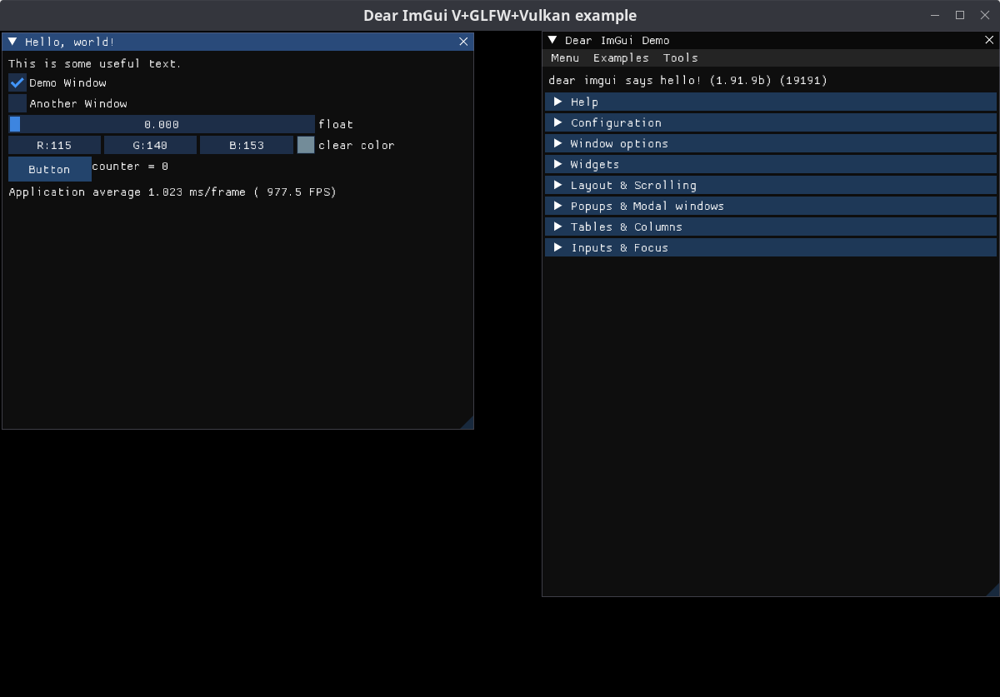

# Dear ImGui and ImPlot examples in V

[Project portfolio](https://oreskin.de/projects_en.php)

Small runnable examples for the [`antono2/imgui`](https://github.com/antono2/imgui)
V bindings. Desktop examples share a GLFW/Vulkan host; the Android example
reuses upstream's native Vulkan/Activity host and constructs its UI in V.

| Example | Demonstrates | Target |
| --- | --- | --- |
| [GLFW/Vulkan](examples/glfw_vulkan/README.md) | Backend initialization, floating windows, docking | Desktop |
| [Widget gallery](examples/widget_gallery/README.md) | Text buffers, controls, combos, tables, popups | Desktop |
| [ImPlot dashboard](examples/implot_dashboard/README.md) | Lines, scatter plots, series selection, rolling history | Desktop |
| [Touch and text](examples/android_touch/README.md) | Touch controls, IME selection, clipboard, scaling | Android |

CI pins ImGui, GLFW, Vulkan, and V revisions. Linux renders all desktop examples
with Vulkan validation in both standard and docking variants; Windows compiles
all desktop examples. Android CI builds debug APKs for three ABIs. Device testing
is required before release; see [the testing checklist](docs/testing.md).

## Try a release

[Download a release](https://github.com/antono2/v_imgui_examples/releases) and follow
[installation instructions](docs/installing-releases.md). Desktop ZIPs bundle
their application runtime libraries; Android APKs include their native libraries
and font. The gallery and Android app include labelled native accessibility
controls, high contrast and text sizing. Choose **Docking** unless you specifically
want the Standard variant.

- **Windows:** extract the ZIP and open `examples.exe` to choose an example.
- **Linux:** extract the ZIP and run `./run.sh` for the example menu.
- **Android:** install the universal APK and open **V ImGui Touch Examples**.

## Build from source

Install V and Git, then run this command from the checkout:

```sh
./setup.vsh
```

Use the official V compiler. The tested compiler revisions are recorded in
[the CI compiler setup](.github/actions/setup-v/action.yml).
On Windows, use `v run setup.vsh` with the same options; the direct executable
script commands below apply to Linux and macOS.

The guided runner lets you choose an example, explains setup changes, builds it
and opens it. It streams build progress and offers to run an existing desktop
build or rebuild it on later visits. Widget gallery is the default choice.
Missing tools are reported with next steps. System package installation requires
confirmation in the guided flow.

For automation, explicit options skip the menus and setup confirmation. System
installers may still request administrator authorization:

```sh
./setup.vsh --install --example widget_gallery --run
./setup.vsh --build-only --example implot_dashboard --run
./setup.vsh --check --example widget_gallery
```

Setup uses an isolated `build/modules` dependency directory and checks out the
ImGui commit recorded in `IMGUI_REVISION`. It does not discard changes in an
existing dependency checkout. Set `VMODULES` to use a different module directory.
The setup may install system prerequisites through the upstream setup script.

Explicit builds only launch when `--run` is supplied. Use `--build-only` to
compile with prepared dependencies, or `--check` for read-only prerequisite
diagnostics. Windows keeps each built example beside its runtime DLLs.

Choose Android in the menu for SDK/NDK detection and connected-device selection.
Install the Android development tools first; the runner can ask for their paths
but does not download the SDK. It builds, installs and opens a debug APK after
confirmation. The guided Android flow requires Bash and the toolchain described
in [Android instructions](examples/android_touch/README.md). Those instructions
also cover explicit builds without installing on a device.

The pinned ImGui commit includes the external-example host options. Use this
revision rather than an older installed module.

The ImGui repository owns native-library setup and pins a tested revision of
this example. On Ubuntu or Debian, the shortest supported path is:

```bash
git clone --recursive https://github.com/antono2/imgui
cd imgui
./scripts/setup_linux.sh --install
./scripts/run_demo.sh
```

Use `./scripts/setup_linux.sh --check` instead when system-changing package
installation is not wanted. See the ImGui
[`QUICKSTART.md`](https://github.com/antono2/imgui/blob/master/QUICKSTART.md)
for Fedora, Windows, static linkage, and bundled-GLFW choices.

## Direct source build

Install the V modules, build the native ImGui library, and configure the
Vulkan/GLFW locations before compiling this repository:

```bash
v install antono2.imgui
cd ~/.vmodules/antono2/imgui
./build_vimgui.sh --linkage shared --glfw system

git clone https://github.com/antono2/v_imgui_examples
cd v_imgui_examples
export VULKAN_SDK=/usr
export GLFW_INCLUDE=/usr/include
export GLFW_LIB=/usr/lib/x86_64-linux-gnu
export VMODULES="${VMODULES:-$HOME/.vmodules}"
v -no-memory-limit -path "$VMODULES/antono2|@vlib|@vmodules" run .
```

The generated ImGui and ImPlot bindings make this an unusually large V
compilation and it may require about 11 GiB of memory. The
`-no-memory-limit` option prevents V's default compiler memory guard from
stopping a machine that has sufficient RAM or swap.

The demo requires a graphical session and a Vulkan-capable GPU/driver. Building
successfully does not guarantee that Vulkan presentation is available on the
selected machine. CI compiles this standalone demo with MSVC and verifies its
native Windows DLL artifacts; graphical presentation still requires a real GPU
session.

The window displays the selected ImGui upstream variant. With the default
`imgui` docking branch it creates a main-viewport dockspace and offers an
optional platform-viewports checkbox for moving ImGui windows outside the GLFW
window. With the `imgui` standard branch, the same source keeps independent
floating windows and reports that docking is unavailable.

## Layout

The root `main.v` retains the GLFW/Vulkan demo as the default. Each new desktop
example has its own `main.v`; the Android UI exports the callback consumed by
the upstream native host. `examples/glfw_vulkan/` contains the shared desktop
loop, native flags, and the default demo UI. ImPlot context/spec objects are
created and destroyed through host lifecycle callbacks.

The release gallery and touch app integrate the application/accessibility layer.
Raw API views retain ordinary ImGui widgets; they do not automatically expose
screen-reader semantics. iOS/Metal remains an upstream source integration.


