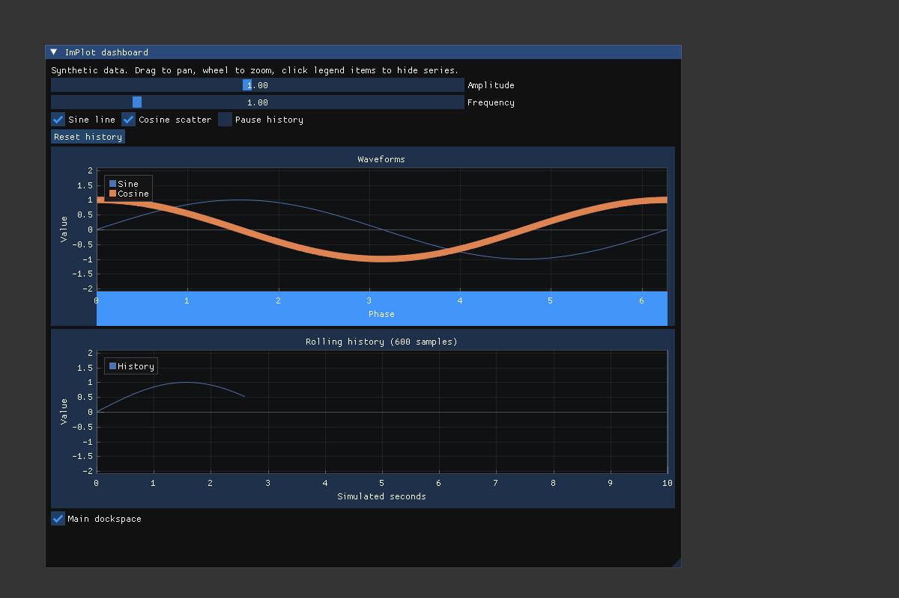

# ImPlot dashboard

From the repository root:

```sh
./setup.vsh --example implot_dashboard
```

On Linux/macOS, launch `build/implot_dashboard`. Windows setup reports its executable.

The example generates sine and cosine samples without files or network access.
It demonstrates line and scatter series, legends, zoom/pan, amplitude/frequency
controls, and a 600-sample rolling buffer. One sample advances by 1/60 simulated
second per rendered frame; this is deterministic simulated time, not wall time.
Pause freezes history while the waveform controls remain editable. Reset empties
history and restarts its clock.

Initialize creates the ImPlot context and a native default plot specification;
shutdown destroys them before the shared host destroys the ImGui context. The
ring's offset becomes the next write position only once all 600 slots are used.
CI renders 660 frames to exercise wraparound.

Change amplitude/frequency, toggle each series, hide series through the legend,
pan/zoom the waveforms, pause/resume history, and reset it. The history plot keeps
its axes locked to the latest ten simulated seconds.


