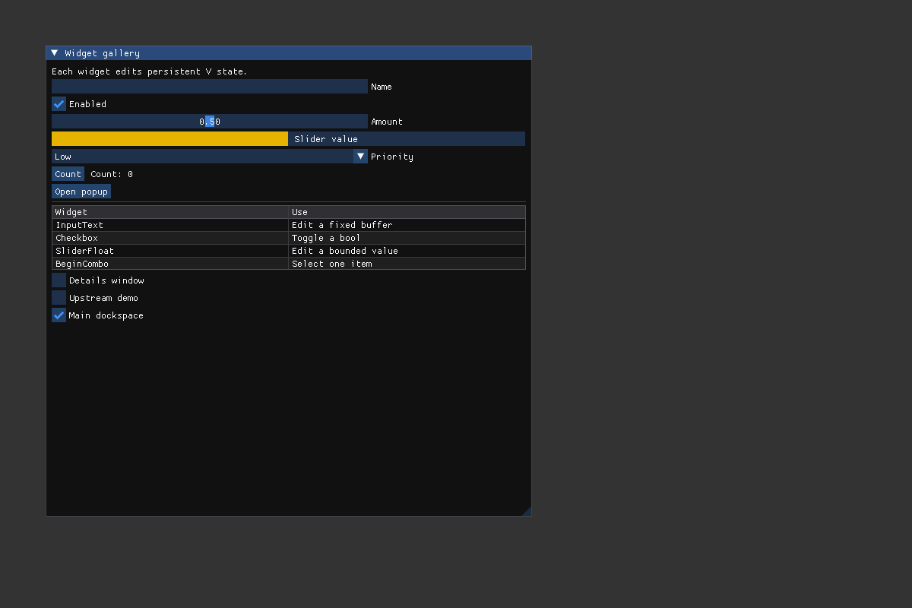

# Widget gallery

From the repository root:

```sh
v run setup.vsh --example widget_gallery
```

On Linux/macOS, launch `build/widget_gallery`. Windows setup reports its executable.

The example keeps widget values in one V struct that outlives every frame. It
shows a fixed text buffer, checkbox, slider, progress indicator, combo, button,
popup, resizable table, and optional secondary window. `Begin`/`End` pairs remain
balanced when windows are collapsed. The name buffer holds at most 127 UTF-8
bytes plus its terminator.

Type a name and open Details; change controls; open/close the popup and Details;
resize table columns; toggle the upstream demo. Docking is optional and the same
source runs against the standard ImGui variant.


